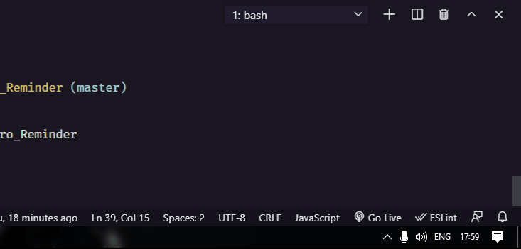

# Pomodoro Reminder 🍅

<h1> </h1>

## Features 🌟
- [x] Notification System;
- [x] Timer System;
- [x] Events System;
- [x] Desktop application with Electron;
- [x] Tray with Electron.

## What i'm learning?

* Browser notifications;
* Import/Export modules;
* Async/Await;
* Exception handling;
* Modern JS (and pure);
* Working with time;
* Event systems (Pub/Sub);
* Desktop Application with Electron.Js;
* ... a lot more

# :white_check_mark: Technologies used

### 🛠️ Technologies

- [Javascript](https://developer.mozilla.org/pt-BR/docs/Web/JavaScript)
- [HTML](https://www.w3schools.com/tags/default.asp)
- [CSS](https://www.w3schools.com/css/default.asp)
- [Electron.Js](https://www.electronjs.org/docs)
- [Node.js](https://nodejs.org/en/)

## Author

**Christofer Assis**

_Programmer who loves what he does and aims to teach the world!_

## Connect with Me 🤝🏻

### :pencil: License

This project is developed under the MIT license. See the archive [LICENSE](LICENSE.md) to know more details.

Project made with love by <strong> Chriszao 💙 </strong>

